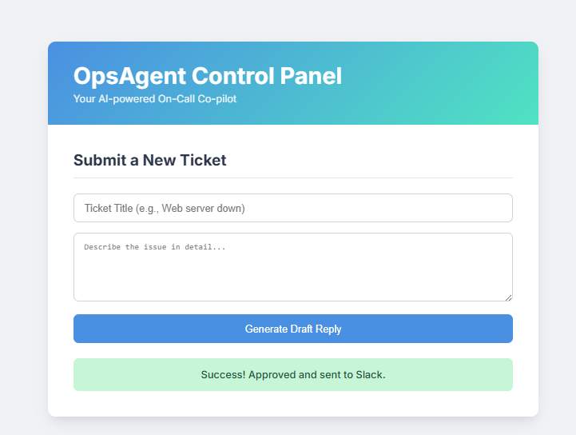

# OpsAgent: Your AI-Powered On-Call Co-pilot

OpsAgent is a smart assistant designed to help IT and DevOps teams resolve incidents faster. It uses a Retrieval-Augmented Generation (RAG) pipeline to understand incoming support tickets, find relevant information from your internal Standard Operating Procedures (SOPs), and draft a high-quality, context-aware response ready for human approval.

This MVP is built with Python, FastAPI, Docker, and powered by Google's Gemini LLM. It's designed to be a lightweight, deployable, and extensible foundation for building more complex agentic workflows.

<!-- 
*(Recommendation: Record a short GIF of your web UI in action and replace the URL above!)* -->

---

## ✨ Features

-   **RAG Pipeline:** Ingests markdown-based SOPs/runbooks from a local folder.
-   **AI-Powered Drafts:** Uses Google Gemini (`gemini-flash-latest`) to generate concise, Slack-style replies based on the retrieved knowledge.
-   **Human-in-the-Loop:** A robust, API-driven workflow ensures a human must approve every AI-generated draft before it's sent.
-   **Slack Integration:** Approved drafts are automatically posted to a designated Slack channel.
-   **Simple Frontend:** A clean, modern web UI for submitting tickets and approving drafts.
-   **Containerized:** Fully containerized with Docker for easy setup and consistent deployment.
-   **Deployable:** Ready to be deployed on cloud services like Render.

---

## 🚀 Getting Started

Follow these instructions to get OpsAgent running on your local machine.

### Prerequisites

-   **Docker Desktop:** Make sure Docker is installed and running on your system.
-   **Git:** For cloning the repository.
-   **API Keys:**
    -   **Google Gemini API Key:** Get one from [Google AI Studio](https://aistudio.google.com/app/apikey).
    -   **Slack Bot Token:** Create a Slack App, give it the `chat:write` scope, and get a Bot Token (`xoxb-...`).


### 1. Clone the Repository

```bash
git clone https://github.com/your-username/your-repo-name.git
cd your-repo-name 
```
### Future Improvements

- Implement a "Reject" workflow with feedback.  
- Add support for more document types (e.g., PDFs, Confluence exports).  
- Store ticket history in a persistent database (e.g., SQLite, PostgreSQL).  
- Enhance the frontend to show a history of pending and approved tickets.  
- Add unit and integration tests. 

 
